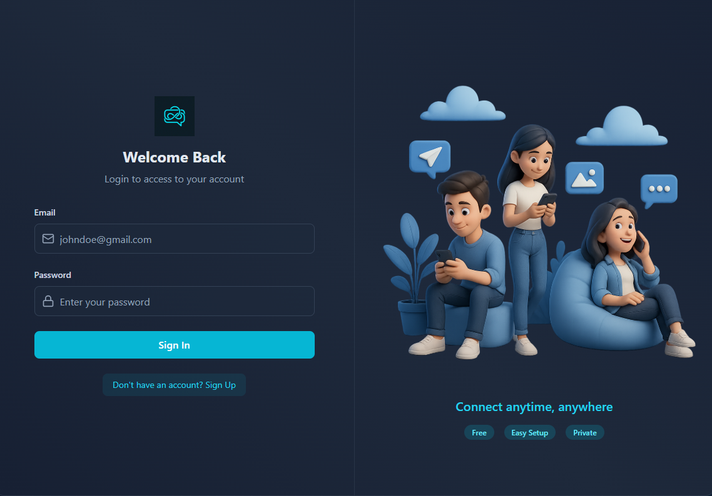
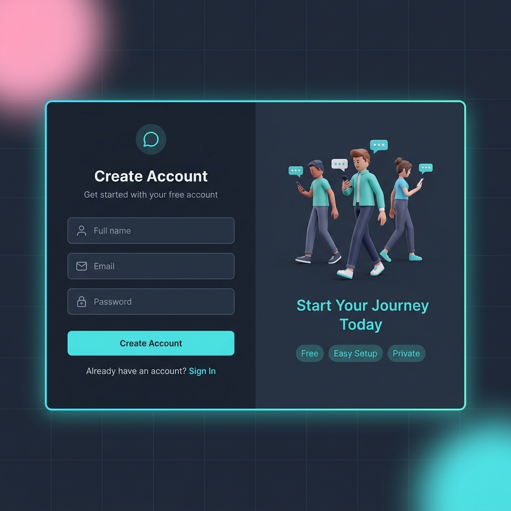
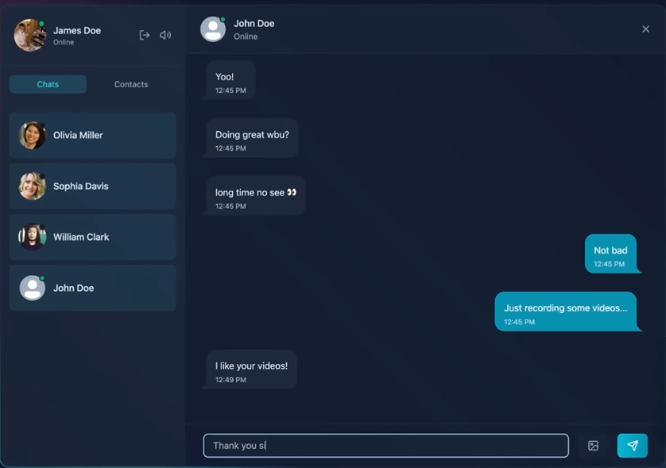
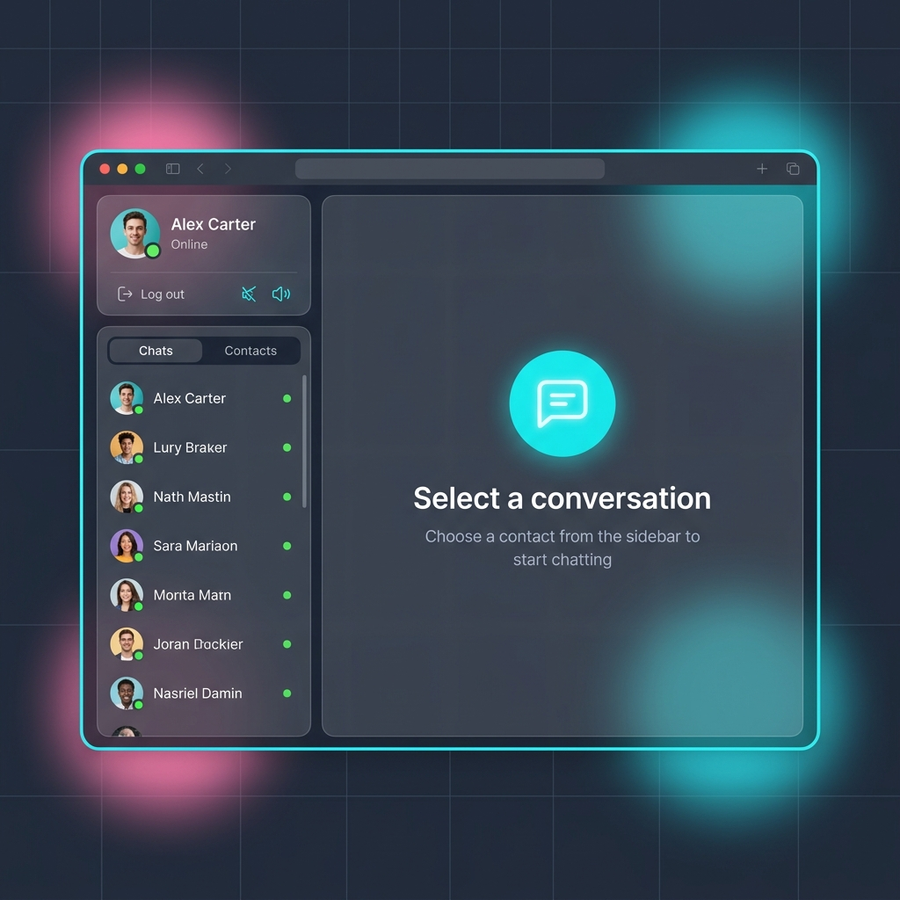
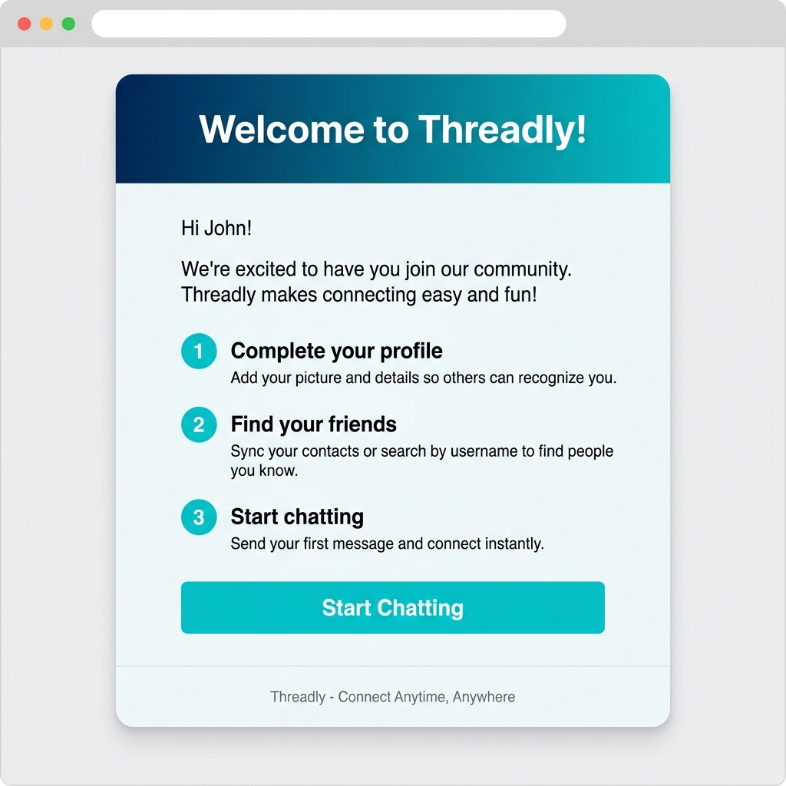

<h1 align="center">🧵 Threadly — Real-Time Messenger Platform</h1>

<p align="center">
  <em>A sleek, full-stack real-time chat application built with the MERN stack, Socket.IO, and a beautiful dark-mode UI.</em>
</p>

<p align="center">
  <a href="https://threadly-poja.onrender.com"></a>
  <a href="#-features"></a>
  <a href="#-tech-stack"></a>
  <a href="LICENSE"></a>
  <a href="https://github.com/ayush-145/Threadly-Real-Time-Messenger-Platform"></a>
  <a href="https://github.com/ayush-145/Threadly-Real-Time-Messenger-Platform/issues"></a>
</p>

<p align="center">
  <a href="https://threadly-poja.onrender.com"><strong>🌐 Live Demo</strong></a> •
  <a href="#-quick-start">Quick Start</a> •
  <a href="#-screenshots">Screenshots</a> •
  <a href="#-features">Features</a> •
  <a href="#-tech-stack">Tech Stack</a> •
  <a href="#-architecture">Architecture</a> •
  <a href="#-api-reference">API Reference</a> •
  <a href="#-contributing">Contributing</a>
</p>

---

## 📸 Screenshots

<details open>
<summary><strong>🔐 Login Page</strong></summary>
<br/>
<p align="center">
  
</p>
<p align="center"><em>Clean two-column login with animated gradient border, 3D illustrations, and frosted glass aesthetics.</em></p>
</details>

<details open>
<summary><strong>📝 Sign Up Page</strong></summary>
<br/>
<p align="center">
  
</p>
<p align="center"><em>Registration with real-time validation, password security, and an inviting "Start Your Journey" onboarding flow.</em></p>
</details>

<details open>
<summary><strong>💬 Chat Page — Active Conversation</strong></summary>
<br/>
<p align="center">
  
</p>
<p align="center"><em>Real-time messaging with online presence indicators, image sharing, keyboard sounds, and auto-scrolling.</em></p>
</details>

<details open>
<summary><strong>🏠 Chat Page — Empty State</strong></summary>
<br/>
<p align="center">
  
</p>
<p align="center"><em>Welcoming empty state with a "Select a conversation" prompt when no chat is active.</em></p>
</details>

<details open>
<summary><strong>📧 Welcome Email</strong></summary>
<br/>
<p align="center">
  
</p>
<p align="center"><em>Beautiful transactional welcome email sent on signup via Resend, with onboarding steps and a CTA.</em></p>
</details>

---

## ✨ Features

### 💬 Real-Time Communication
| Feature | Description |
|---|---|
| **Instant Messaging** | Send and receive text messages in real-time powered by Socket.IO |
| **Image Sharing** | Upload and share images in conversations with preview thumbnails |
| **Online Presence** | See who's online/offline with live green/gray status indicators |
| **Optimistic Updates** | Messages appear instantly in the UI before server confirmation |
| **Notification Sounds** | Audio alerts when receiving new messages |
| **Keyboard Sounds** | Immersive mechanical keyboard sound effects while typing (toggleable) |

### 🔐 Security & Authentication
| Feature | Description |
|---|---|
| **JWT Authentication** | Secure HTTP-only cookie-based JWT auth (7-day expiry) |
| **Password Hashing** | bcrypt with 10 salt rounds for secure password storage |
| **Rate Limiting** | Arcjet-powered sliding window rate limiter (100 req/60s) |
| **Bot Protection** | Automated bot detection and blocking (except search engines) |
| **Attack Shield** | Protection against SQL injection, XSS, and common attacks |
| **Socket Auth** | WebSocket connections authenticated via JWT cookie handshake |

### 🎨 UI/UX Excellence
| Feature | Description |
|---|---|
| **Dark Mode Design** | Premium slate-900 dark theme with cyan/teal accent palette |
| **Animated Borders** | Rotating conic-gradient border animation on major containers |
| **Frosted Glass** | `backdrop-blur` glassmorphism on sidebar and chat panels |
| **Decorative Backgrounds** | CSS grid overlay with pink and cyan blur glows |
| **Loading Skeletons** | Pulsing skeleton placeholders while data loads |
| **Quick Reply Suggestions** | "👋 Say Hello", "🤝 How are you?" buttons on empty conversations |
| **Profile Picture Upload** | Click-to-upload avatar with hover overlay and instant preview |
| **Escape to Close** | Press `Esc` to deselect a conversation |
| **Auto-scroll** | Smooth scroll to the latest message on arrival |
| **Responsive Layout** | Auth pages stack on mobile; illustrations hidden on small screens |

### 📧 Transactional Emails
- Styled **welcome email** sent on signup via [Resend](https://resend.com)
- Custom HTML template with gradient header, onboarding steps, and CTA button

---

## 🛠️ Tech Stack

<table>
<tr>
<td align="center" width="50%">

### Frontend
| Technology | Purpose |
|---|---|
|  | UI library |
|  | Build tool & dev server |
|  | Utility-first CSS |
|  | Component library |
|  | State management |
|  | Real-time client |
|  | Icon library |

</td>
<td align="center" width="50%">

### Backend
| Technology | Purpose |
|---|---|
|  | Runtime |
|  | Web framework |
|  | Database |
|  | ODM |
|  | Real-time server |
|  | Image hosting |
|  | Security layer |

</td>
</tr>
</table>

---

## 🏗️ Architecture

```
Threadly/
├── 📦 package.json              # Root package — build & start scripts
├── 📄 LICENSE                    # MIT License
│
├── 🔧 backend/
│   └── src/
│       ├── server.js             # Express app entry point
│       ├── controllers/
│       │   ├── auth.controller.js      # Signup, login, logout, profile update
│       │   └── message.controller.js   # Send/get messages, contacts, chat partners
│       ├── models/
│       │   ├── User.js           # User schema (name, email, password, profilePic)
│       │   └── Message.js        # Message schema (sender, receiver, text, image)
│       ├── routes/
│       │   ├── auth.route.js     # Auth endpoints
│       │   └── message.route.js  # Messaging endpoints
│       ├── middleware/
│       │   ├── auth.middleware.js        # JWT cookie verification
│       │   ├── arcjet.middleware.js      # Rate limiting & bot protection
│       │   └── socket.auth.middleware.js # WebSocket JWT authentication
│       ├── lib/
│       │   ├── socket.js         # Socket.IO server + online user tracking
│       │   ├── arcjet.js         # Arcjet security config
│       │   ├── cloudinary.js     # Cloudinary SDK config
│       │   ├── db.js             # MongoDB connection
│       │   ├── env.js            # Centralized env variables
│       │   ├── resend.js         # Resend email client
│       │   └── utils.js          # JWT generation & cookie setting
│       └── emails/
│           ├── emailHandlers.js  # Welcome email sender
│           └── emailTemplate.js  # HTML email template
│
├── 🎨 frontend/
│   ├── index.html
│   ├── vite.config.js
│   ├── tailwind.config.js        # TailwindCSS + DaisyUI + animated border
│   └── src/
│       ├── App.jsx               # Router + auth check + decorative bg
│       ├── main.jsx              # React entry point
│       ├── index.css             # Global styles & auth form classes
│       ├── pages/
│       │   ├── LoginPage.jsx     # Two-column login with illustration
│       │   ├── SignUpPage.jsx    # Two-column signup with illustration
│       │   └── ChatPage.jsx      # Main chat layout (sidebar + chat area)
│       ├── components/
│       │   ├── BorderAnimatedContainer.jsx  # Rotating gradient border wrapper
│       │   ├── ProfileHeader.jsx            # User avatar, logout, sound toggle
│       │   ├── ActiveTabSwitch.jsx          # Chats/Contacts tab switcher
│       │   ├── ChatsList.jsx                # Previous conversation list
│       │   ├── ContactList.jsx              # All registered users list
│       │   ├── ChatContainer.jsx            # Message display area
│       │   ├── ChatHeader.jsx               # Selected user header bar
│       │   ├── MessageInput.jsx             # Text/image input with sounds
│       │   ├── NoChatHistoryPlaceholder.jsx # Empty chat state with suggestions
│       │   ├── NoChatsFound.jsx             # No conversations placeholder
│       │   ├── NoConversationPlaceholder.jsx # Select a conversation placeholder
│       │   ├── MessagesLoadingSkeleton.jsx  # Chat loading skeleton
│       │   ├── UsersLoadingSkeleton.jsx     # User list loading skeleton
│       │   └── PageLoader.jsx               # Full-screen auth loading spinner
│       ├── store/
│       │   ├── useAuthStore.js    # Auth state + socket connection (Zustand)
│       │   └── useChatStore.js    # Chat state + real-time subscriptions (Zustand)
│       ├── hooks/
│       │   └── useKeyboardSound.js  # Mechanical keyboard sound hook
│       └── lib/
│           └── axios.js           # Axios instance with base URL & credentials
│
└── 📸 screenshots/               # README screenshots
```

### System Design

```
┌─────────────────────────────────────────────────────────────┐
│                     CLIENT (React + Vite)                     │
│  ┌──────────┐  ┌──────────┐  ┌──────────┐  ┌─────────────┐ │
│  │  Zustand  │  │Socket.IO │  │  Axios   │  │  DaisyUI +  │ │
│  │  Stores   │  │  Client  │  │  HTTP    │  │  Tailwind   │ │
│  └────┬─────┘  └────┬─────┘  └────┬─────┘  └─────────────┘ │
└───────┼──────────────┼─────────────┼────────────────────────┘
        │              │             │
        │    WebSocket │     REST API│
        │              │             │
┌───────┼──────────────┼─────────────┼────────────────────────┐
│       │         SERVER (Express + Socket.IO)                 │
│  ┌────┴─────┐  ┌────┴─────┐  ┌────┴─────┐  ┌────────────┐ │
│  │  Arcjet   │  │ Socket   │  │  JWT     │  │ Cloudinary │ │
│  │ Security  │  │ Handler  │  │  Auth    │  │  Uploads   │ │
│  └──────────┘  └──────────┘  └────┬─────┘  └────────────┘ │
│                                    │                         │
│  ┌─────────────────────────────────┴───────────────────────┐ │
│  │                    MongoDB (Mongoose)                     │ │
│  │          Users Collection  •  Messages Collection         │ │
│  └──────────────────────────────────────────────────────────┘ │
│                                                               │
│  ┌──────────────┐                                            │
│  │ Resend Email │ → Welcome emails on signup                 │
│  └──────────────┘                                            │
└──────────────────────────────────────────────────────────────┘
```

---

## 📡 API Reference

### Authentication — `/api/auth`

| Method | Endpoint | Auth | Description |
|:---:|---|:---:|---|
| `POST` | `/api/auth/signup` | ❌ | Register a new user account |
| `POST` | `/api/auth/login` | ❌ | Login with email & password |
| `POST` | `/api/auth/logout` | ❌ | Logout and clear session cookie |
| `PUT` | `/api/auth/update-profile` | ✅ | Upload/update profile picture |
| `GET` | `/api/auth/check` | ✅ | Check auth status & get current user |

### Messaging — `/api/messages`

| Method | Endpoint | Auth | Description |
|:---:|---|:---:|---|
| `GET` | `/api/messages/contacts` | ✅ | Get all registered users |
| `GET` | `/api/messages/chats` | ✅ | Get users you've chatted with |
| `GET` | `/api/messages/:userId` | ✅ | Get message history with a user |
| `POST` | `/api/messages/send/:userId` | ✅ | Send a text/image message |

### Socket.IO Events

| Event | Direction | Description |
|---|:---:|---|
| `getOnlineUsers` | Server → Client | Broadcasts online user IDs on connect/disconnect |
| `newMessage` | Server → Client | Delivers new message to recipient in real-time |

---

## 🚀 Quick Start

### Prerequisites

- **Node.js** ≥ 20.0.0
- **MongoDB** — [MongoDB Atlas](https://www.mongodb.com/atlas) (free tier) or local instance
- **Cloudinary** account — [Sign up free](https://cloudinary.com/)
- **Resend** account — [Sign up free](https://resend.com/) (for welcome emails)
- **Arcjet** account — [Sign up free](https://arcjet.com/) (for security/rate limiting)

### 1. Clone the Repository

```bash
git clone https://github.com/ayush-145/Threadly-Real-Time-Messenger-Platform.git
cd Threadly-Real-Time-Messenger-Platform
```

### 2. Set Up Environment Variables

Create a `.env` file inside the `backend/` directory:

```bash
cp backend/.env.example backend/.env
```

Then fill in your values:

```env
# Server
PORT=3000
NODE_ENV=development

# Database
MONGODB_URI=mongodb+srv://<username>:<password>@cluster.mongodb.net/Threadly_db

# Authentication
JWT_SECRET=your_super_secret_jwt_key_here

# Email (Resend)
RESEND_API_KEY=re_your_resend_api_key
EMAIL_FROM=onboarding@resend.dev
EMAIL_FROM_NAME=Your Name

# Frontend URL (for CORS & emails)
CLIENT_URL=http://localhost:5173

# Image Upload (Cloudinary)
CLOUDINARY_CLOUD_NAME=your_cloud_name
CLOUDINARY_API_KEY=your_api_key
CLOUDINARY_API_SECRET=your_api_secret

# Security (Arcjet)
ARCJET_KEY=ajkey_your_arcjet_key
ARCJET_ENV=development
```

### 3. Install Dependencies

```bash
# Install backend dependencies
cd backend
npm install

# Install frontend dependencies
cd ../frontend
npm install
```

### 4. Run the Development Servers

Open **two terminals**:

```bash
# Terminal 1 — Backend (runs on :3000)
cd backend
npm run dev

# Terminal 2 — Frontend (runs on :5173)
cd frontend
npm run dev
```

### 5. Open in Browser

Navigate to **[http://localhost:5173](http://localhost:5173)** and start chatting! 🎉

### Production Build

```bash
# From root directory — installs deps & builds frontend
npm run build

# Start production server (serves frontend from Express)
npm start
```

---

## 🔐 Environment Variables Reference

| Variable | Required | Description |
|---|:---:|---|
| `PORT` | ✅ | Server port (default: `3000`) |
| `NODE_ENV` | ✅ | `development` or `production` |
| `MONGODB_URI` | ✅ | MongoDB connection string |
| `JWT_SECRET` | ✅ | Secret key for signing JWTs |
| `RESEND_API_KEY` | ✅ | Resend API key for transactional emails |
| `EMAIL_FROM` | ✅ | Sender email address |
| `EMAIL_FROM_NAME` | ✅ | Sender display name |
| `CLIENT_URL` | ✅ | Frontend URL for CORS configuration |
| `CLOUDINARY_CLOUD_NAME` | ✅ | Cloudinary cloud name |
| `CLOUDINARY_API_KEY` | ✅ | Cloudinary API key |
| `CLOUDINARY_API_SECRET` | ✅ | Cloudinary API secret |
| `ARCJET_KEY` | ✅ | Arcjet security API key |
| `ARCJET_ENV` | ⬜ | Arcjet environment (`development`/`production`) |

---

## 🤝 Contributing

Contributions are welcome! Please read the **[Contributing Guide](CONTRIBUTING.md)** for detailed instructions on:

- 🚀 Getting started (fork → branch → PR workflow)
- 📝 Commit conventions ([Conventional Commits](https://www.conventionalcommits.org/))
- 🎨 Coding standards (frontend & backend)
- 🐛 Reporting bugs & suggesting features
- 🔀 Pull request process & review expectations

---

## 📝 License

This project is licensed under the **MIT License** — see the [LICENSE](LICENSE) file for details.

---

## 🙏 Acknowledgements

- [React](https://react.dev/) — UI library
- [Socket.IO](https://socket.io/) — Real-time engine
- [MongoDB](https://www.mongodb.com/) — Database
- [Cloudinary](https://cloudinary.com/) — Image management
- [Resend](https://resend.com/) — Transactional emails
- [Arcjet](https://arcjet.com/) — Application security
- [DaisyUI](https://daisyui.com/) — Component library
- [Tailwind CSS](https://tailwindcss.com/) — Utility-first CSS
- [Lucide Icons](https://lucide.dev/) — Icon library
- [Zustand](https://zustand.docs.pmnd.rs/) — State management

---

<p align="center">
  <strong>⭐ If you found this project useful, please give it a star!</strong>
</p>

<p align="center">
  Made with ❤️ by <a href="https://github.com/ayush-145">Ayush Jha</a>
</p>

<p align="center">
  <a href="https://github.com/ayush-145/Threadly-Real-Time-Messenger-Platform/issues">Report Bug</a> •
  <a href="https://github.com/ayush-145/Threadly-Real-Time-Messenger-Platform/issues">Request Feature</a>
</p>
